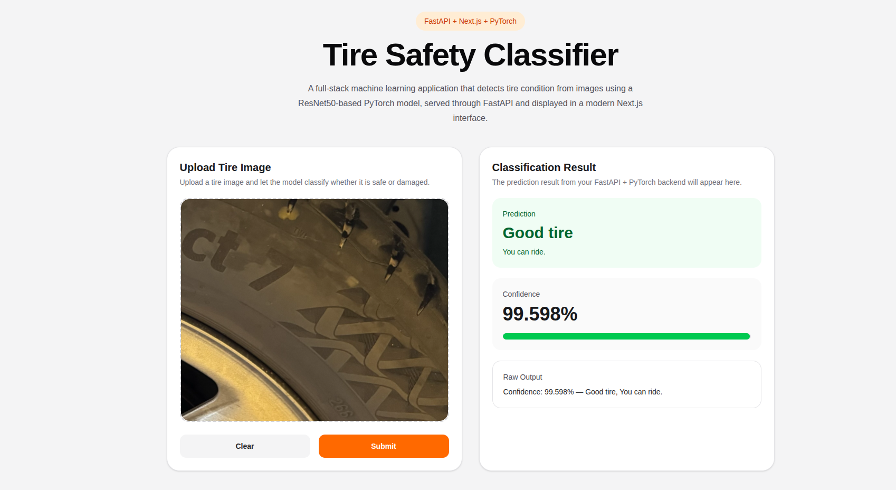

# 🛞 Tire Safety Classifier

<p align="center">
  
</p>

<p align="center">
  <strong>A full-stack computer vision application for tire quality classification using ResNet50 transfer learning, FastAPI, Next.js, Vercel, and Hugging Face Spaces.</strong>
</p>

<p align="center">
  <a href="https://tire-classifier-fullstack.vercel.app"><strong>🌐 Live Demo</strong></a>
  ·
  <a href="https://promzy007-tire-classifier-backend.hf.space/api/health"><strong>⚙️ Backend Health Check</strong></a>
  ·
  <a href="docs/demo/tire-classifier-demo.mp4"><strong>🎥 Demo Video</strong></a>
</p>

---

## 📌 Overview

**Tire Safety Classifier** is a deployed full-stack machine learning application that classifies tire condition from uploaded images.

The system allows a user to upload a tire image through a modern web interface. The image is sent to a FastAPI backend, processed by a PyTorch model, and returned as a structured prediction containing:

- tire condition label
- confidence score
- safety status
- user-facing recommendation

Example output:

```text
Confidence: 99.598% — Good tire, You can ride.
```

This project began as a PyTorch and Gradio learning exercise inspired by **Jannis Seemann’s hands-on PyTorch course**, then evolved into a complete full-stack machine learning application using **FastAPI**, **Next.js**, **Vercel**, and **Hugging Face Spaces**.

The project demonstrates the complete workflow of taking a computer vision model from local experimentation to a deployed full-stack application.

---

## 🎬 Demo

Demo files are stored in the following structure:

```text
docs/
├── images/
│   └── demo-homepage.png
└── demo/
    └── tire-classifier-demo.mp4
```

### Demo Screenshot

<p align="center">
  
</p>

### Demo Video

<p align="center">
  <a href="docs/demo/tire-classifier-demo.mp4">
    
  </a>
</p>

---

## ✅ Current Deployment Status

| Component | Technology | Platform | Status |
|---|---|---|---|
| Frontend | Next.js, TypeScript, Tailwind CSS | Vercel | Live |
| Backend | FastAPI, PyTorch, TorchVision | Hugging Face Spaces | Live |
| Model | ResNet50 feature extractor + custom classifier head | PyTorch | Working |
| API | REST API | FastAPI | Working |
| Image Upload | Browser upload + multipart request | Next.js + FastAPI | Working |

---

## 🏗️ System Architecture

```text
User Browser
    |
    | Upload tire image
    v
Next.js Frontend
Hosted on Vercel
    |
    | POST /api/predict
    v
FastAPI Backend
Hosted on Hugging Face Spaces
    |
    | Preprocess image
    | Run PyTorch inference
    v
ResNet50 Transfer Learning Model
    |
    | Return JSON prediction
    v
Frontend Result Card
```

---

## 🔗 Live URLs

### Frontend

```text
https://tire-classifier-fullstack.vercel.app
```

### Backend

```text
https://promzy007-tire-classifier-backend.hf.space
```

### Health Check

```text
https://promzy007-tire-classifier-backend.hf.space/api/health
```

Expected health response:

```json
{
  "status": "ok",
  "message": "Tire classifier backend is running."
}
```

---

## 🧠 Machine Learning Theory

## 1. What Is ResNet?

**ResNet**, short for **Residual Network**, is a deep convolutional neural network architecture designed to solve the problem of training very deep neural networks.

Traditional deep networks can suffer from degradation problems as more layers are added. This means that after a certain depth, adding more layers can make optimization harder and performance worse.

ResNet addresses this using **residual connections**, also called **skip connections**.

Instead of forcing a network block to learn a direct mapping:

```text
H(x)
```

ResNet allows the block to learn a residual function:

```text
F(x) = H(x) - x
```

The final block output becomes:

```text
H(x) = F(x) + x
```

In simple terms, the model learns what needs to change from the input, instead of learning the full transformation from scratch.

This helps gradients flow through the network more effectively during training and makes it possible to train very deep models.

---

## 2. Why ResNet50?

This project uses **ResNet50**, a 50-layer version of ResNet.

ResNet50 is commonly used in computer vision because it provides a strong balance between:

- representation power
- training stability
- feature extraction quality
- practical deployment feasibility

In this project, ResNet50 is used as a **feature extractor**.

That means the model uses the pretrained ResNet50 convolutional layers to extract meaningful visual features from tire images, such as:

- cracks
- surface texture
- sidewall patterns
- wear marks
- tread condition
- visual damage indicators

---

## 3. What Is Transfer Learning?

**Transfer learning** is a machine learning technique where a model trained on one large dataset is reused for another related task.

Instead of training a computer vision model from zero, this project starts with a ResNet50 model pretrained on ImageNet.

ImageNet pretraining gives the model useful low-level and high-level visual understanding, such as:

- edges
- curves
- textures
- object shapes
- lighting patterns
- image composition

The model then adapts this learned visual knowledge to the tire classification task.

---

## 4. Why Transfer Learning Was Used

Training a deep CNN from scratch usually requires:

- a very large dataset
- significant GPU resources
- long training time
- careful tuning

Transfer learning reduces these requirements.

For this project, transfer learning is useful because:

- tire images are visual and texture-based
- ResNet50 already understands general image features
- only the classification head needs to learn the tire-specific decision boundary
- the model can reach useful performance with less data and less training time

---

## 5. Model Architecture Used

The model architecture follows this structure:

```text
Input Tire Image
    |
    v
Resize to 224 x 224
    |
    v
Normalize using ImageNet statistics
    |
    v
Pretrained ResNet50 Backbone
    |
    v
Remove original ImageNet classification layer
    |
    v
2048-dimensional feature vector
    |
    v
Custom fully connected classifier
    |
    v
Sigmoid activation
    |
    v
Binary prediction: Good tire or Bad tire
```

The original ResNet50 classification layer was replaced with an identity layer:

```python
resnet50_model.fc = nn.Identity()
```

This makes ResNet50 output a 2048-dimensional feature vector instead of ImageNet class probabilities.

A custom classifier head was then attached:

```python
fc_model = nn.Sequential(
    nn.Linear(2048, 1024),
    nn.ReLU(),
    nn.Linear(1024, 1)
)
```

The complete model is:

```python
model = nn.Sequential(
    resnet50_model,
    fc_model
)
```

---

## 6. Binary Classification Logic

The model outputs one value.

A sigmoid activation converts that output into a probability-like score between 0 and 1:

```python
y_pred = torch.sigmoid(model(image_tensor))
```

The value is converted to a percentage:

```python
percentage = round(y_pred.item() * 100, 3)
```

The decision rule is:

```python
if percentage > 50:
    label = "Good tire"
    recommendation = "You can ride."
    status = "safe"
else:
    label = "Bad tire"
    recommendation = "Avoid riding for safety."
    status = "danger"
```

---

## 7. Image Preprocessing

The deployed backend applies the same preprocessing pipeline used during model development:

```python
preprocess = transforms.Compose(
    [
        transforms.Resize((224, 224)),
        transforms.ToTensor(),
        transforms.Normalize(
            mean=[0.485, 0.456, 0.406],
            std=[0.229, 0.224, 0.225],
        ),
    ]
)
```

This preprocessing is important because pretrained ResNet models expect images normalized using ImageNet statistics.

---

## 🧰 Technology Stack

## Frontend

- Next.js
- TypeScript
- React
- Tailwind CSS
- Vercel

## Backend

- FastAPI
- Uvicorn
- Python Multipart
- PyTorch
- TorchVision
- Pillow
- NumPy
- Docker
- Hugging Face Spaces

## Model

- ResNet50 pretrained backbone
- Custom binary classifier head
- Sigmoid output activation
- PyTorch model weights stored as `model.pth`

## Deployment

- GitHub for source control
- Vercel for frontend hosting
- Hugging Face Spaces for backend inference hosting
- Git LFS for model weight tracking

---

## 📁 Repository Structure

```text
tire-classifier-fullstack/
├── backend/
│   ├── app/
│   │   ├── api/
│   │   │   └── routes.py
│   │   ├── models/
│   │   │   └── model.pth
│   │   ├── services/
│   │   │   └── predictor.py
│   │   ├── app.py
│   │   └── main.py
│   ├── Dockerfile
│   ├── requirements.txt
│   └── vercel.json
│
├── frontend/
│   ├── app/
│   │   ├── favicon.ico
│   │   ├── globals.css
│   │   ├── layout.tsx
│   │   └── page.tsx
│   ├── components/
│   │   └── TireClassifier.tsx
│   ├── lib/
│   │   └── api.ts
│   ├── public/
│   ├── package.json
│   ├── package-lock.json
│   ├── next.config.ts
│   ├── postcss.config.mjs
│   ├── eslint.config.mjs
│   └── tsconfig.json
│
├── docs/
│   ├── images/
│   │   └── demo-homepage.png
│   └── demo/
│       └── tire-classifier-demo.mp4
│
├── .gitignore
└── README.md
```

---

## ⚙️ Backend API

The backend exposes three main routes.

| Method | Endpoint | Description |
|---|---|---|
| GET | `/` | API metadata |
| GET | `/api/health` | Backend health check |
| POST | `/api/predict` | Tire image classification |

---

## Root Endpoint

```text
GET /
```

Example response:

```json
{
  "message": "Tire Classifier API",
  "docs": "/docs",
  "health": "/api/health",
  "predict": "/api/predict"
}
```

---

## Health Endpoint

```text
GET /api/health
```

Example response:

```json
{
  "status": "ok",
  "message": "Tire classifier backend is running."
}
```

---

## Prediction Endpoint

```text
POST /api/predict
```

Request type:

```text
multipart/form-data
```

Required field:

```text
file
```

Example response:

```json
{
  "confidence": 99.598,
  "label": "Good tire",
  "status": "safe",
  "recommendation": "You can ride.",
  "message": "Confidence: 99.598% — Good tire, You can ride."
}
```

---

## 💻 Frontend Functionality

The frontend provides:

- tire image upload
- image preview
- clear button
- submit button
- loading state
- error handling
- prediction result card
- confidence score visualization
- raw model output display

Frontend flow:

```text
User selects image
    |
    v
Image preview appears
    |
    v
User clicks Submit
    |
    v
Frontend sends image to backend
    |
    v
Backend returns prediction JSON
    |
    v
Frontend displays result
```

---

## 🔌 Frontend API Client

The frontend sends images to the backend using `FormData`.

```typescript
const API_URL = process.env.NEXT_PUBLIC_API_URL || "http://127.0.0.1:8000";

export async function classifyTireImage(file: File) {
  const formData = new FormData();
  formData.append("file", file);

  const response = await fetch(`${API_URL}/api/predict`, {
    method: "POST",
    body: formData,
  });

  if (!response.ok) {
    const error = await response.json().catch(() => null);
    throw new Error(error?.detail || "Prediction failed.");
  }

  return response.json();
}
```

---

## 🚀 Reproducing the Project Locally

## 1. Clone the Repository

```bash
git clone https://github.com/promzyadiole/tire-classifier-fullstack.git
cd tire-classifier-fullstack
```

---

## 2. Backend Setup

Move into the backend directory:

```bash
cd backend
```

Create a virtual environment:

```bash
python3 -m venv .venv
source .venv/bin/activate
```

Install dependencies:

```bash
pip install -r requirements.txt
```

Run the backend:

```bash
uvicorn app.main:app --reload
```

The backend should run at:

```text
http://127.0.0.1:8000
```

Test:

```text
http://127.0.0.1:8000/api/health
```

---

## 3. Frontend Setup

Open a second terminal.

Move into the frontend directory:

```bash
cd frontend
```

Install dependencies:

```bash
npm install
```

Create a local environment file:

```bash
touch .env.local
```

Add:

```env
NEXT_PUBLIC_API_URL=http://127.0.0.1:8000
```

Run the frontend:

```bash
npm run dev
```

The frontend should run at:

```text
http://localhost:3000
```

---

## 4. Local End-to-End Test

With both backend and frontend running:

1. Open `http://localhost:3000`
2. Upload a tire image
3. Click **Submit**
4. Confirm that a prediction appears

---

## 🐳 Running Backend with Docker

Move into the backend folder:

```bash
cd backend
```

Build the Docker image:

```bash
docker build -t tire-classifier-backend .
```

Run the container:

```bash
docker run -p 7860:7860 tire-classifier-backend
```

Test:

```text
http://localhost:7860/api/health
```

---

## ☁️ Deployment Workflow

## 1. Frontend Deployment on Vercel

The frontend is deployed separately from the backend.

Recommended Vercel settings:

```text
Framework Preset: Next.js
Root Directory: frontend
Build Command: default
Install Command: default
Output Directory: default
```

Production environment variable:

```env
NEXT_PUBLIC_API_URL=https://promzy007-tire-classifier-backend.hf.space
```

After changing environment variables, redeploy the Vercel project so the new value is included in the production build.

---

## 2. Backend Deployment on Hugging Face Spaces

The backend is deployed as a Docker Space.

Hugging Face Space settings:

```text
SDK: Docker
Docker Template: Blank
Hardware: CPU Basic
Visibility: Public
```

The backend listens on port `7860`.

Dockerfile:

```dockerfile
FROM python:3.11-slim

WORKDIR /app

RUN apt-get update && apt-get install -y \
    libgl1 \
    libglib2.0-0 \
    curl \
    && rm -rf /var/lib/apt/lists/*

COPY requirements.txt .

RUN pip install --upgrade pip
RUN pip install --no-cache-dir -r requirements.txt

COPY app ./app

EXPOSE 7860

CMD ["uvicorn", "app.main:app", "--host", "0.0.0.0", "--port", "7860"]
```

---

## 3. Pushing Backend to Hugging Face Spaces

Clone the Space repository:

```bash
git clone https://huggingface.co/spaces/Promzy007/tire-classifier-backend hf-tire-classifier-backend
cd hf-tire-classifier-backend
```

Copy backend files:

```bash
cp -r ../tire-classifier-fullstack/backend/app .
cp ../tire-classifier-fullstack/backend/requirements.txt .
cp ../tire-classifier-fullstack/backend/Dockerfile .
```

Create `.dockerignore`:

```bash
cat > .dockerignore <<'EOF'
.git
__pycache__
*.pyc
.venv
.env
.env.local
EOF
```

Install Git LFS:

```bash
sudo apt update
sudo apt install git-lfs -y
```

Track the model weights:

```bash
git lfs install
git lfs track "app/models/model.pth"
```

Commit and push:

```bash
git add .
git commit -m "Deploy FastAPI tire classifier backend"
git push
```

When prompted:

```text
Username: your Hugging Face username
Password: your Hugging Face access token
```

---

## 🔐 Security Note

Hugging Face access tokens are used only for authentication when pushing code to Hugging Face.

Do not commit tokens, display them in screenshots, or share them in public.

If a token is exposed, revoke it and create a new one.

---

## 🧪 API Testing

## Health Check

```bash
curl https://promzy007-tire-classifier-backend.hf.space/api/health
```

Expected response:

```json
{
  "status": "ok",
  "message": "Tire classifier backend is running."
}
```

## Prediction Request

```bash
curl -X POST \
  -F "file=@path/to/tire-image.jpg" \
  https://promzy007-tire-classifier-backend.hf.space/api/predict
```

Expected response:

```json
{
  "confidence": 99.598,
  "label": "Good tire",
  "status": "safe",
  "recommendation": "You can ride.",
  "message": "Confidence: 99.598% — Good tire, You can ride."
}
```

---

## 🧾 Dataset Attribution

This project uses the **Tire Quality Classification** dataset.

Dataset source:

```text
https://www.kaggle.com/datasets/warcoder/tyre-quality-classification
```

Dataset collaborator credited in the dataset note:

```text
Chirag Chauhan
```

Dataset license:

```text
Creative Commons Attribution 4.0 International — CC BY 4.0
```

License URL:

```text
https://creativecommons.org/licenses/by/4.0/
```

When using or adapting this dataset, attribution must be retained according to the CC BY 4.0 license.

---

## 🙏 Acknowledgements

This project was initially inspired by and developed while following the PyTorch learning course:

**“From Zero to your own models: Learn PyTorch with hands-on projects. No previous experience required.”**

Special acknowledgement goes to **Jannis Seemann**, the course instructor, for providing the practical learning foundation that guided the original model development and Gradio-based deployment workflow.

The course introduced the core deep learning workflow used in this project, including:

- PyTorch fundamentals
- image classification workflows
- convolutional neural networks
- transfer learning
- ResNet-based classification
- model training and evaluation
- practical deployment using Gradio

This repository extends beyond the original tutorial implementation by converting the project into a full-stack deployed machine learning application with:

- a custom FastAPI backend
- a modern Next.js and TypeScript frontend
- production frontend deployment on Vercel
- Docker-based backend deployment on Hugging Face Spaces
- REST API integration between frontend and backend
- public cloud-based inference using the trained PyTorch model

The tutorial provided the foundation, while this project expands the work into an end-to-end full-stack ML deployment pipeline.

---

## ⚠️ Practical Deployment Notes

During deployment, the backend was tested on multiple platforms.

Vercel worked well for the Next.js frontend, but the PyTorch backend was too large for Vercel serverless functions.

Render Free was also not suitable for this backend because the free instance memory was too limited for PyTorch and TorchVision.

Hugging Face Spaces with Docker was selected for the backend because it is better suited for ML inference demos.

Final deployment choice:

```text
Frontend: Vercel
Backend: Hugging Face Spaces
```

---

## 🚧 Future Improvements

Potential improvements include:

- Add classification metrics
- Add confusion matrix
- Add Grad-CAM visualization
- Add batch image prediction
- Add prediction history
- Add confidence calibration
- Add model versioning
- Export model to ONNX
- Replace ResNet50 with a lighter model for faster inference
- Add automated tests
- Add Docker Compose for local development
- Add custom domain
- Add rate limiting
- Add logging and monitoring

---

## 🏁 Final Result

The project successfully demonstrates a working full-stack machine learning deployment.

Final workflow:

```text
Image Upload
    |
    v
Next.js Frontend
    |
    v
FastAPI Backend
    |
    v
PyTorch ResNet50 Transfer Learning Model
    |
    v
Prediction Result
```

---

## 🙌 Author

```text
Promise Adiole
```

GitHub:

```text
https://github.com/promzyadiole
```

Hugging Face:

```text
https://huggingface.co/Promzy007
```

---

## 📄 License

The dataset used in this project is licensed under:

```text
Creative Commons Attribution 4.0 International — CC BY 4.0
```

The source code license can be added separately depending on your preferred repository license, such as MIT.